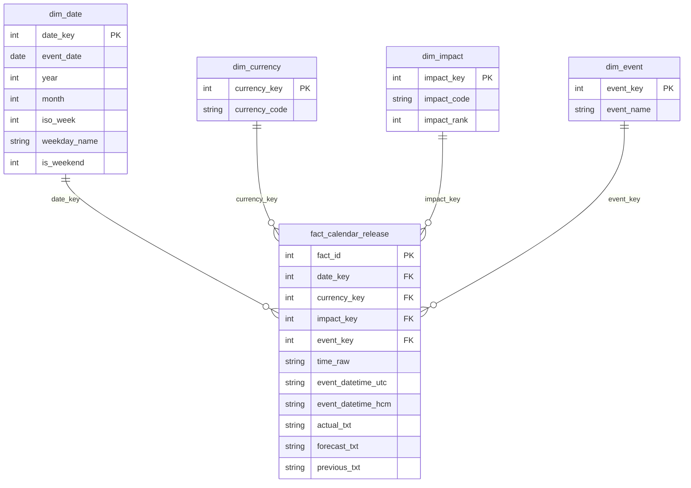

# Medallion Architecture — Financial Calendar ETL

> Standard for this repo. Keep It Simple (KISS).  
> Inspired by Databricks Medallion (Bronze → Silver → Gold).

## Verdict on previous layout

| Layer | Before | Compliant? |
|-------|--------|------------|
| Bronze | Parsed CSV, sometimes **already filtered** to red-only | **No** — not raw / not complete |
| Silver | Google Calendar CSV (`Subject`, `Start Date`, …) | **No** — that is a **consumer export**, not SSOT |
| Gold | Missing / mixed into silver | **No** |

Google Calendar CSV is **one delivery variant** derived from Silver. It must not live in Silver.

---

## Target layout (KISS)

```
data/
├── bronze/
│   ├── raw/                      # immutable source dumps
│   │   └── calendar/
│   │       └── 2026/
│   │           ├── 01_all.md     # optional full month
│   │           └── 01_red.md     # high-impact dump when full blocked
│   └── landing/                  # lightly parsed, no business filter
│       └── calendar_events/
│           └── 2026_01.csv
│
├── silver/
│   └── calendar_events/          # Single Source of Truth (cleaned)
│       └── 2026_01.csv
│
└── gold/
    ├── google_calendar/          # delivery: GCal import
    │   └── 2026-01-news.csv
    └── mart/                     # Kimball star (analytics)
        ├── dim_date.csv
        ├── dim_currency.csv
        ├── dim_impact.csv
        ├── dim_event.csv
        └── fact_calendar_release.csv
```

Metadata (timezone, source URL, ingest time) lives next to bronze landing as `*.meta.json`.

---

## Layer contracts

### 1. Bronze — Raw + landing

**Goal:** Do not lose source truth. Reprocess anytime.

| Artifact | Rule |
|----------|------|
| `bronze/raw/...` | Exact dump from Forex Factory (markdown/HTML). Never edit. |
| `bronze/landing/...` | Parse dump → rows. **No** currency/impact filter. Values stay strings. |

Landing schema (minimal):

| Column | Meaning |
|--------|---------|
| `date` | As printed by source (`Jan 5`) |
| `time` | As printed (`7:00am`, `All Day`, …) |
| `currency` | As printed |
| `impact` | As printed / from impact-filter dump (`red` if dump was `impacts=3`) |
| `event` | Event name |
| `actual` | Raw string (`N/A` allowed) |
| `forecast` | Raw string |
| `previous` | Raw string |
| `source_file` | Path to raw dump |
| `ingested_at` | UTC ISO timestamp |

If only a red dump exists for a month, landing may contain only high-impact rows — still bronze, but **incomplete coverage**. Prefer full dump when available. Monthly fetch must include `impacts=0` (gray / holiday); R/O/Y-only dumps omit bank holidays and therefore understate session closures.

### 2. Silver — Cleansed & conformed SSOT

**Goal:** One reliable table for analytics and further products.

Rules:

- Parse dates/times with known `source_timezone`
- Convert to `event_datetime_utc` and `event_datetime_hcm`
- Normalize nulls (`N/A`, blank → empty/null)
- Partition by **business time**: one file per event month, `calendar_events/YYYY_MM.csv`
- Identify a row by the absolute release instant: `(event_datetime_utc, currency, event)`
- Keep **all** currencies and impacts (no red-only / USD-only filter here)
- Typed where practical; flat conformed table (star schema lives in Gold mart)

#### Write strategy — coalesce upsert

`actual` is a **late-arriving measure**: an event is published with an empty
actual and only gets a value after the release. So silver is never overwritten,
it is upserted field by field, and an empty incoming value never wins:

```python
actual   = new.actual   or old.actual
forecast = new.forecast or old.forecast
previous = new.previous or old.previous
impact   = new.impact   or old.impact
```

A non-empty revision *does* overwrite — the rule is "empty never wins", not
"old always wins". `updated_at` moves only on a real delta, so re-running the
same input rewrites the file byte-for-byte and leaves the git diff empty.

`scripts/transform/merge_silver.py` implements this with two modes:

| Mode | Caller | Behaviour |
|---|---|---|
| `merge` | this-week export (step B) | Insert + coalesce only. The feed covers one week of a wider partition, so it must never delete. |
| `refresh` | monthly HTML dump (step A2) | Same coalescing, and may prune with `delete_missing=True`. |

Pruning is **opt-in** because a dump is only authoritative as of the moment it
was captured: an older dump replayed today would otherwise delete rows a newer
source has since added. When on, it is limited to the impact layers the dump
actually carried, so a gray holiday row survives a red/orange/yellow refresh.

Why the identity is the instant and not the published clock: the this-week
export publishes US Eastern while the monthly dump publishes the scraping
account's timezone. Across those two sources, a key containing `time_raw`
matched **0** rows; the instant matched **91 of 92**. `time_raw` therefore only
identifies untimed rows — `All Day`, `Tentative`, `Sep Data` — which carry no
instant at all. `time_raw`, `source_timezone` and `event_datetime_hcm` are held
immutable, since `time_raw` is meaningless apart from its own timezone.

Every delta is appended to `silver/calendar_event_changes/YYYY_MM.csv`
(`changed_at, source, change_type, event_uid, …, field, old_value, new_value`),
which is the audit trail for a revised actual.

Silver schema:

| Column | Type / note |
|--------|-------------|
| `event_uid` | Hash of the row identity; becomes `fact_id` in the mart |
| `event_date` | `YYYY-MM-DD` |
| `time_raw` | Original clock string |
| `event_datetime_utc` | ISO, nullable if no clock time |
| `event_datetime_hcm` | ISO Asia/Ho_Chi_Minh, nullable |
| `currency` | ISO-like code |
| `impact` | `red` / `orange` / `yellow` / `gray` |
| `event` | Name |
| `actual` | Cleaned string or empty |
| `forecast` | Cleaned string or empty |
| `previous` | Cleaned string or empty |
| `source_timezone` | IANA tz used for conversion |
| `first_seen_at` | When the row was first inserted (kept across upserts) |
| `updated_at` | Last real change to a measure; unchanged on a no-op run |

### 3. Gold — Business / consumer products

**Goal:** Ready-to-use slices for a specific use case.

| Product | Path | Rule |
|---------|------|------|
| Google Calendar import | `gold/google_calendar/{yyyy-mm}-news.csv` | Filter `impact=red` + `currency ∈ {USD,GBP,EUR}` + timed events; HCM wall clock; GCal columns. Holidays stay in Silver/mart (usually All Day, not this product). |
| Kimball mart | `gold/mart/` | Star schema from Silver for BI / Looker. Deterministic full rebuild: `fact_id` is the silver `event_uid` and every dim key is a hash of its business key, so gaining a row never renumbers the existing ones. Analyst prompts compare actual vs forecast on the **same `fact_id`**, which only holds if that id is stable. |

#### Kimball star (simple)

Grain of fact: **one calendar release row** (one currency + event + date/time).



| Table | Role |
|-------|------|
| `dim_date` | Calendar attributes |
| `dim_currency` | USD/EUR/… |
| `dim_impact` | red/orange/yellow/gray + rank |
| `dim_event` | Event name dictionary |
| `fact_calendar_release` | Release values (actual/forecast/previous kept as text for KISS) |

Build: `python scripts/transform/to_kimball.py`

---

## Data flow

```text
Forex Factory
    → bronze/raw (dump, immutable, gzipped + retention)
    → bronze/landing (parse, no filter, overwrite per partition)
    → silver/calendar_events/YYYY_MM.csv (clean, type, tz, COALESCE UPSERT)
        → silver/calendar_event_changes/YYYY_MM.csv (append-only delta log)
        → gold/google_calendar (GCal import)
        → gold/mart (Kimball dims + fact, deterministic rebuild)
```

Recompute rule: change Gold logic → rebuild from Silver. Change Silver logic → rebuild from Bronze landing/raw. Never scrape again unless Bronze is missing.

Exception to "never scrape again": the this-week export carries **no** `Actual`
column, so the monthly HTML dump is the only source of printed values. Step A2
(`scripts/extract/backfill_actuals.py`) re-scrapes the current month — and the
previous one during the first days of a new month — fetching all four impact
layers including gray/`impacts=0`. It is non-fatal and skippable with
`--skip-actual-backfill`. Dropping the gray layer is what left the mart with a
single holiday across nine months, so `scripts/transform/validate_coverage.py`
now warns when a partition is missing an impact layer.

---

## Ingestion Coordination: Two-Pipeline Architecture

To balance operational simplicity (no Cloudflare friction weekly) with complete historical depth (printed actuals and full holiday liquidity), the system coordinates two distinct pipelines that write into the **same Silver monthly partitions**:

### 1. Pipeline Comparison

| Criteria | Pipeline 1: Weekly ABCD (Primary Operational) | Pipeline 2: Monthly / Historical (Backfill & Archival) |
|---|---|---|
| **Main Scripts** | `scripts/run_weekly_abcd.py` | `scripts/extract/fetch_bronze_months.py` + `scripts/run_medallion.py` |
| **Data Source** | CDN `nfs.faireconomy.media/ff_calendar_thisweek.{csv,xml,json}` | Web HTML `forexfactory.com/calendar?month=...&impacts=3,2,1,0` |
| **Network Egress** | Direct network (no WARP required, no TLS blocks) | Requires Cloudflare WARP (UDP) or residential proxy (`FF_HTTP_PROXY`) |
| **Actuals Coverage** | CDN has **no** `actual` field; automatically backfilled via Step A2 (`backfill_actuals.py`) | 100% full printed `actual` for all elapsed events |
| **Holiday Coverage** | Includes Bank Holidays in this-week feed | Full `impacts=0` gray layer across the whole month |
| **Silver Write Mode** | `mode="merge"` (insert new events, coalesce forecasts/actuals, never delete) | `mode="refresh"` (coalesce upsert, opt-in prune via `--prune`) |
| **Operational Cadence** | Routine weekly execution (Sunday / Monday morning) | One-off historical backfill or deep reconciliation |

### 2. Coordination & Deduplication Flow

```text
[Weekly CDN Export]                        [Monthly HTML Dump]
(Fast, No WARP, Forecasts only)            (WARP/Proxy, 4 Layers, Has Actuals)
         │                                          │
         ▼                                          ▼
Step A: Bronze Landing                     Step A2: Bronze Landing
(data/bronze/landing/...)                  (data/bronze/landing/...)
         │                                          │
         └────────────────────┬─────────────────────┘
                              ▼
                Standardize to UTC Timestamp
             event_datetime_utc = f(date, time)
                              │
                              ▼
                     Derive `event_uid`
      sha1(event_datetime_utc | currency | event)[:16]
                              │
                              ▼
                 Coalesce Upsert into Silver
            data/silver/calendar_events/YYYY_MM.csv
             - Match on event_uid (Deduplication)
             - Empty incoming never overwrites stored data
             - Non-empty actuals update stored rows
                              │
                              ▼
                    Audit Delta Logging
         data/silver/calendar_event_changes/YYYY_MM.csv
             (changed_at, source, field, old_val, new_val)
```

1. **Deterministic Identity (Deduplication):** Events from both pipelines map to UTC. Caching and deduplication use `event_uid`, preventing duplicate rows regardless of ingest order.
2. **Coalesce Rule ("Empty never wins"):** An empty incoming value cannot overwrite a populated field (`merged = new.val or old.val`). When Weekly ingests first without actuals, a subsequent Monthly run fills in `actual` without dropping the row.
3. **Partition Alignment:** Both pipelines partition strictly by business month (`YYYY_MM.csv`), eliminating cross-granularity week/month file clutter in Silver.

### 3. Separation of Concerns: Deterministic Data Engine vs. LLM Analyst Layer

To guarantee 100% deterministic reproducibility, zero token consumption during extraction/ETL, and modular architecture:
- **This Repository (`ff-transform-data`):** Serves strictly as the **Deterministic Medallion & Fact Pack Engine**.
  - Pipeline steps A (fetch), A2 (actuals backfill), B (Silver coalesce upsert + Gold Kimball mart rebuild), C0 (ICT metrics), and C (Fact Pack generation) run purely on deterministic Python/pandas logic.
  - The final delivery artifact for analytics is the **Fact Pack** (`reports/weekly/YYYY-Www-fact-pack.json` & `.md`), pre-computing all counts, event clusters, liquidity holidays, and clash windows directly from the Gold Kimball mart.
- **LLM Analyst Layer (Step D):** Paused by default in this repo (`--with-llm` flag required to opt-in). This layer is designed to be pushed/delegated to an external agent repository that consumes the pre-computed Fact Pack and Gold Mart as read-only inputs.

---

## What we deliberately skip (KISS)

- No Delta Lake / Unity Catalog required
- No separate “raw” vs “landing” databases — folders + CSV are enough for now
- No numeric parsing of `1.2%` / `55K` yet (stay `*_txt` on fact)
- No SCD Type 2 history on the fact. Revisions are captured as an append-only
  delta log in `silver/calendar_event_changes/`, not as versioned fact rows.
- No incremental Gold. At ~3k rows the mart rebuilds in under a second, and the
  hash surrogate keys make that rebuild deterministic — revisit at ~1M silver
  rows or a ~100MB mart.

---

## References

1. Databricks — [What is a medallion architecture?](https://www.databricks.com/blog/what-is-medallion-architecture)
2. dataengineering.wiki — Medallion Architecture
3. Kimball Group — dimensional modeling (star schema)
4. This repo: flat-file Medallion + simple Kimball mart in Gold
