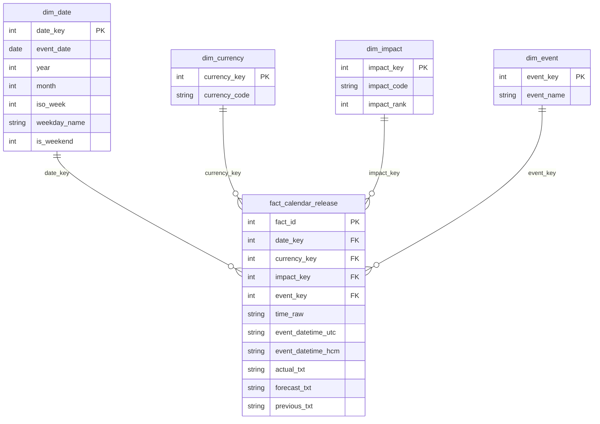

# Medallion Architecture — Financial Calendar ETL

> Standard for this repo. Keep It Simple (KISS).  
> Inspired by Databricks Medallion (Bronze → Silver → Gold).

## Verdict on previous layout

| Layer | Before | Compliant? |
|-------|--------|------------|
| Bronze | Parsed CSV, sometimes **already filtered** to red-only | **No** — not raw / not complete |
| Silver | Google Calendar CSV (`Subject`, `Start Date`, …) | **No** — that is a **consumer export**, not SSOT |
| Gold | Missing / mixed into silver | **No** |

Google Calendar CSV is **one delivery variant** derived from Silver. It must not live in Silver.

---

## Target layout (KISS)

```
data/
├── bronze/
│   ├── raw/                      # immutable source dumps
│   │   └── calendar/
│   │       └── 2026/
│   │           ├── 01_all.md     # optional full month
│   │           └── 01_red.md     # high-impact dump when full blocked
│   └── landing/                  # lightly parsed, no business filter
│       └── calendar_events/
│           └── 2026_01.csv
│
├── silver/
│   └── calendar_events/          # Single Source of Truth (cleaned)
│       └── 2026_01.csv
│
└── gold/
    ├── google_calendar/          # delivery: GCal import
    │   └── 2026-01-news.csv
    └── mart/                     # Kimball star (analytics)
        ├── dim_date.csv
        ├── dim_currency.csv
        ├── dim_impact.csv
        ├── dim_event.csv
        └── fact_calendar_release.csv
```

Metadata (timezone, source URL, ingest time) lives next to bronze landing as `*.meta.json`.

---

## Layer contracts

### 1. Bronze — Raw + landing

**Goal:** Do not lose source truth. Reprocess anytime.

| Artifact | Rule |
|----------|------|
| `bronze/raw/...` | Exact dump from Forex Factory (markdown/HTML). Never edit. |
| `bronze/landing/...` | Parse dump → rows. **No** currency/impact filter. Values stay strings. |

Landing schema (minimal):

| Column | Meaning |
|--------|---------|
| `date` | As printed by source (`Jan 5`) |
| `time` | As printed (`7:00am`, `All Day`, …) |
| `currency` | As printed |
| `impact` | As printed / from impact-filter dump (`red` if dump was `impacts=3`) |
| `event` | Event name |
| `actual` | Raw string (`N/A` allowed) |
| `forecast` | Raw string |
| `previous` | Raw string |
| `source_file` | Path to raw dump |
| `ingested_at` | UTC ISO timestamp |

If only a red dump exists for a month, landing may contain only high-impact rows — still bronze, but **incomplete coverage**. Prefer full dump when available. Monthly fetch must include `impacts=0` (gray / holiday); R/O/Y-only dumps omit bank holidays and therefore understate session closures.

### 2. Silver — Cleansed & conformed SSOT

**Goal:** One reliable table for analytics and further products.

Rules:

- Parse dates/times with known `source_timezone`
- Convert to `event_datetime_utc` and `event_datetime_hcm`
- Normalize nulls (`N/A`, blank → empty/null)
- Deduplicate on natural key: `(event_date, time_raw, currency, event)`
- Keep **all** currencies and impacts (no red-only / USD-only filter here)
- Typed where practical; flat conformed table (star schema lives in Gold mart)

Silver schema:

| Column | Type / note |
|--------|-------------|
| `event_date` | `YYYY-MM-DD` |
| `time_raw` | Original clock string |
| `event_datetime_utc` | ISO, nullable if no clock time |
| `event_datetime_hcm` | ISO Asia/Ho_Chi_Minh, nullable |
| `currency` | ISO-like code |
| `impact` | `red` / `orange` / `yellow` / `gray` |
| `event` | Name |
| `actual` | Cleaned string or empty |
| `forecast` | Cleaned string or empty |
| `previous` | Cleaned string or empty |
| `source_timezone` | IANA tz used for conversion |
| `updated_at` | When silver row was built |

### 3. Gold — Business / consumer products

**Goal:** Ready-to-use slices for a specific use case.

| Product | Path | Rule |
|---------|------|------|
| Google Calendar import | `gold/google_calendar/{yyyy-mm}-news.csv` | Filter `impact=red` + `currency ∈ {USD,GBP,EUR}` + timed events; HCM wall clock; GCal columns. Holidays stay in Silver/mart (usually All Day, not this product). |
| Kimball mart | `gold/mart/` | Star schema from Silver for BI / Looker |

#### Kimball star (simple)

Grain of fact: **one calendar release row** (one currency + event + date/time).



| Table | Role |
|-------|------|
| `dim_date` | Calendar attributes |
| `dim_currency` | USD/EUR/… |
| `dim_impact` | red/orange/yellow/gray + rank |
| `dim_event` | Event name dictionary |
| `fact_calendar_release` | Release values (actual/forecast/previous kept as text for KISS) |

Build: `python scripts/transform/to_kimball.py`

---

## Data flow

```text
Forex Factory
    → bronze/raw (dump)
    → bronze/landing (parse, no filter)
    → silver/calendar_events (clean, type, tz, dedupe)
        → gold/google_calendar (GCal import)
        → gold/mart (Kimball dims + fact)
```

Recompute rule: change Gold logic → rebuild from Silver. Change Silver logic → rebuild from Bronze landing/raw. Never scrape again unless Bronze is missing.

---

## What we deliberately skip (KISS)

- No Delta Lake / Unity Catalog required
- No separate “raw” vs “landing” databases — folders + CSV are enough for now
- No numeric parsing of `1.2%` / `55K` yet (stay `*_txt` on fact)
- Weekly forecast→actual delta can be a later fact or bridge table

---

## References

1. Databricks — [What is a medallion architecture?](https://www.databricks.com/blog/what-is-medallion-architecture)
2. dataengineering.wiki — Medallion Architecture
3. Kimball Group — dimensional modeling (star schema)
4. This repo: flat-file Medallion + simple Kimball mart in Gold
